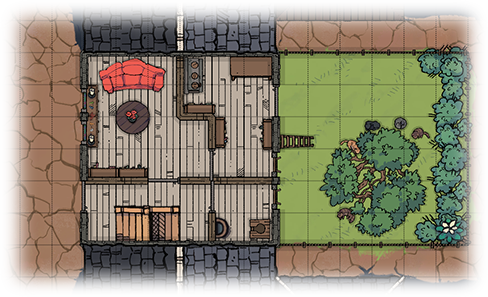

# Aid the Elderly
*Single session one-shot for one or more characters. No combat expected.*

## Adventure text
[aid-the-elderly.md](aid-the-elderly.md)

## Maps, 50x42
- [colour, 5 ft grid](aid-the-elderly.colour-5ft.50x42.png)
- [colour, no grid](aid-the-elderly.colour-nogrid.50x42.png)
- [monochrome, 5 ft grid](aid-the-elderly.bw-5ft.50x42.png)
- [monochrome, no grid](aid-the-elderly.bw-nogrid.50x42.png)
- [Dungeondraft source file](aid-the-elderly.dungeondraft_map) (open with [Dungeondraft](https://dungeondraft.net/))
- Map made with assets from [2-Minute Tabletop](https://2minutetabletop.com/)

## Other resources
* https://tinodidriksen.com/dnd-one-shot-aid-the-elderly/
* Google Drive: https://drive.google.com/drive/folders/1sYSOhrLeQqLKkAPQUK8t9MOeQ8IRSdAm
* [Development process](development.md)

## Copyright
Copyright 2024 [Tino Didriksen](https://tinodidriksen.com/). This work is openly licensed via [Creative Commons Attribution-ShareAlike 4.0 (CC BY-SA)](https://creativecommons.org/licenses/by-sa/4.0/).
