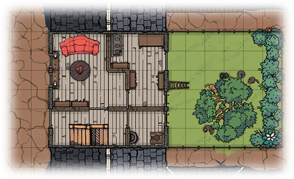

# Aid the Elderly
*Single session one-shot for one or more characters. No combat expected.*

## Adventure Hook
A little old lady who needs help with a spring cleaning ritual and feeding her cats.

## Background
Hundreds of years ago during a great war in a battle going poorly, Archmage Lady Elara Timell made a desperate bargain with one of the primordial demons she had enslaved to fight at her side. She would live a full, long, and healthy life in exchange for her soul upon death. This let her overload her magic without fear of dying, thus winning the battle and eventually the war.

And then she noticed a loophole in the contract: If she imprisoned the demon so that it could not claim her soul, she could live forever, in good health. She promptly did so. But the seal only lasts about a decade per casting, becoming weakest around the time where the stars align a certain way.

Elara has long since become a quiet force for good. She mostly keeps to herself, and her studies of the skies and other planes.

A few renewal cycles back, the seal got so weak that the demon managed to curse Elara. From that point on, the seal can only be fully renewed by someone who doesn't know they are doing it. The more the person knows, the weaker the seal will be, meaning Elara herself cannot renew it at all. Thus, she enlists aid from taverns and passersby, in the guise of an old lady who needs help with a spring cleaning ritual and feeding her cats.

This time, the seal is weak enough that the demon can communicate a little, and play some simple tricks on Elara.

## Running the Adventure
Elara will not reveal her full name, title, or occupation until it is relevant. Unless the characters specifically ask, don't even mention her name is Elara. She is merely an old lady who needs help, and she likes colours.

Elara will not reveal the true purpose of the ritual, even at the pain of death. Doing so would render the ritual moot, and the demon would break free and harvest her soul. She can be pressed to reveal snippets to make her case and make the party proceed, but the more she reveals, the weaker the final seal will be, requiring her to renew it much sooner than the normal decade. Only after the renewal is complete will she answer all questions.

The role of the DM is to make it ambiguous whether the players should help Elara or the demon. There are plenty of hints to make the players distrust Elara. On one hand, there is a little old lady who could answer all the questions but doesn't want to, and is in a bit of a rush to have the ritual completed, and on the other hand there is a demon that wants to break free but can't communicate properly.

If the characters attack Elara, her full mage robes and regalia will reveal itself and rebuff the attack. She won't be hostile at first, but instead ask what spurred them to attack her. If it was because of the demon, she will plead not to trust it, but instead trust her and finish the ritual. If the characters continue hostilities, Elara will defend herself as an appropriately levelled archmage, and she will be very disappointed in the characters. She cannot be killed through ordinary means while the demon remains bound, but she can be knocked unconscious.

It is more interesting if a key aspect of the demon is unknown to the players. This writeup uses Primordial aspect and language, but if the characters know Primordial then substitute it for something else.

Elara's house is bigger on the inside. It is in fact a small mage tower, with extradimensional space for multiple floors and a garden. Time also works slightly differently - at the ground floor it is always noon, and it gets later in the day the higher up you go, while still remaining the same time beyond the tower. Characters shouldn't notice this right away, but if they naturally comment on the peculiar behaviour, then inform them as needed.

The tower resists foreign magic. Anyone besides Elara trying to cast a spell other than *Detect Magic* must first roll a D20. On a 15 or above, the spell succeeds, but the caster can feel how difficult it was to cast. On a failure, the spell slot is expended but the spell won't cast. Any continuous effect will wear off after a very short while (e.g., Druid *Wild Shape* will dispel itself after a few minutes at most). Casting *Detect Magic* will privately reveal to the caster that everything around them is magic (walls, floor, furniture, everything), rendering the result both informative and worthless.

Casting a spell using a higher spell slot will lower the difficulty by 5 for each level above (e.g. casting *Detect Evil and Good* using a level 2 slot is DC10), but the effect is capped at the lowest possible level.

Magic items and creatures brought in from the outside are not inherently affected - it is not an anti-magic field - but using them to cast spells or cause effects is subject to the same resistance.

### Items
#### Amulet of Half Tongues (*Wondrous item, rare, 500 gp*)
Hold the amulet in both hands and name a language. For the next hour, the wearer of the amulet can talk in that language. Only talk, though. They cannot understand the language, but they can read texts in the language out loud and translate into the language, without consciously comprehending what they are saying. The language can be changed once the effect wears off.

## Chores for Elara
The chores that Elara wants done are:

### 1) Feed the cats
There are five cats in her back garden hiding from the noon sun under the shade of a tree, and they need food. The party must go to the market to a specific shop and buy beef, chicken, deer, and kraken meat. Elara will ask if anyone can read Infernal or Abyssal, and if not then she shrugs it off and says she can write down the name for comparison. She will also provide a purse to pay for it all.

The shopkeeper, Haston, will sell the party false kraken meat. It is highly unlikely anyone will have the skill to detect this. When returning to Elara, she will ask if it's genuine, and taste a tiny morsel to determine that it is not. She will ask who sold them this meat, because "*I've been a good customer for years, and they should know better!*". When told that Haston was the shopkeeper, she will say "*Oh! I supposed it was a matter of time before the son took over. It has been a decade after all. Well then, go back and ask for genuine kraken meat. And I don't like to do this, but if they keep being obstinate then tell them Elara sent you.*". This might be the first time Elara's name comes up.

Haston will mutter something about "*…you tourists don't know the real stuff from this anyway…*" and if pushed will say that yes, they do have real kraken meat, but it is reserved for important clients. Haston doesn't know who Elara is, but the commotion will attract the attention of his father, Frimtol, in the back rooms who will come out and ask what the ruckus is about, and repeat that kraken meat is reserved for respectable clients. As soon as Frimtol hears Elara mentioned, he will shush Haston and say "*My deepest apologies! You should have said so right away. Agents of Lady Elara will of course have the finest kraken meat. It's been so long, I simply forgot to inform my son of this standing arrangement, back when he took over running the day to day business.*". Elara will confirm this is genuine meat.

The actual feeding of the cats involves getting them to their individual cages on the first floor, since they are rather competitive about food. And they should stay in the cages for a while after. There is a ladder leaning against the house so that the cats can climb to the first floor window. Luring them up there involves an Animal Handling (DC 15) roll per cat. Failure means that cat will be scared of the character and run off to hide in the bushes. Another character can then try Animal Handling (DC 10) to lure it close enough, and Dexterity (DC 15) to catch it.

After every successful feeding, that character rolls Perception (DC 15). For every success, they notice that the fed cat shimmers with increasingly strong magic.

Should a cat die or become too injured to eat, the sealing ritual will fail, unless Elara can persuade the party to go to an exotic pet store and find a suitable replacement - but it should be difficult to do so in time.

### 2) Arrange rocks and light candles
Every above-ground floor has a collection of coloured rocks (ground, first, second, and third floor) and some candles (those floors, plus fourth floor). Elara says she was something of a geologist in her early days, and she would like the rocks arranged in the way that they catch the morning light best, and then light the candles after each arrangement. The rocks are green basalt, blue obsidian, red gabbro, orange scoria, and white rhyolite, but unless the characters know anything about rocks, only mention the colours.

Those who do ask or know rocks will be able to tell these are igneous rocks that are not normally these colours. Elara will simply say she likes colours.

The first floor's rocks are strewn across the floor. The cats must have been playing with them. One of the rocks is missing. If asked, Elara will mutter under her breath (Perception DC 15) "*…that little trickster…*" and ask to complete everything else first, because maybe the rock will be on one of the other floors. If everything else is done, she will reluctantly ask the characters to check the sub-basement, but not to touch anything else down there.

With every successful arrangement and candle lighting, that character rolls Perception (DC 15). For every success, they notice they are getting more tired. For each lighting, all their stats are temporarily reduced, but in a way they won't notice and isn't lethal, and they will be restored when the ritual is complete (or fails).

Should a rock become damaged or broken, the sealing ritual will fail, unless Elara can persuade the party to go out to buy and cut a replacement - but it should be difficult to do so in time. The candles are trivially replaceable.

### 3) Place Flowers and Incense
Elara wants an arrangement of flowers, and incense made from said flowers, placed in front of each statue of a cat on the upper floors (first, second, third). The flowers she wants are blue dandelions, red lotuses, purple roses, black dahlias, and green tulips. If the characters don't have these, Elara will provide them with enough money to buy them. And if the characters can't craft incense themselves, Elara will also provide money for that.

The florist at the market will try to pass off dyed dahlias and dandelions as the real thing, which the characters can notice (Insight DC 15). The florist doesn't know how to craft incense, but will direct the characters to a nearby monk. If the monk is given dyed flowers to work with, she will remark that they are a different colour on the inside. If the characters are crafting the incense themselves, they can similarly easily notice this.

The statue on the third floor is missing. If asked, Elara will be surprised and initially won't believe it. Upon seeing the truth for herself, she will mutter under her breath (Perception DC 15) "*…I waited too long…*" and ask to complete everything else first, because maybe the statue will be on one of the other floors. If everything else is done, she will reluctantly ask the characters to check the sub-basement, but not to touch anything else down there.

With every successful arrangement of flowers and lit incense, that character rolls Perception (DC 15). For every success, they notice the surroundings getting colder.

Should a statue become damaged or broken, the sealing ritual will fail, unless Elara can persuade the party to go out and have a replacement made - but it should be difficult to do so in time.

### The Final Chore
Once those three chores are done, Elara will say there is a final little piece. She will ask one of the characters to read poems from a book. One poem in Elvish, one in Draconic, and one in Primordial.

Of the poems that the characters understand, they will see they are very good and evocative, with strong imagery. An Arcana or Religion check (DC20) will reveal the poems are cleverly disguised powerful spells of binding, with the evocative language actually evoking the magic of the sealing ritual.

If the characters don't speak some of the languages - and it is highly unlikely they will speak Primordial - then Elara will lend them an Amulet of Half Tongues. She will hold it in both hands and speak the name of the language, then hang it around the neck of the one reading the poems for them to read out loud. Elara can change the language of the amulet as often as she likes.

Proceed to *Conclusion*.

## Areas
### Street View
Elara's home is a small one story townhouse (25 by 20 feet), tightly boxed in on all sides by taller buildings. She will invite the party in for tea (proceed to Ground Floor) while she lays out the chores she needs doing.

When entering the first time, everyone rolls Perception (DC 20). If any succeed, privately tell that character that they notice a white cat looking down at them from the attic.

If asked, Elara will say that the white cat is one of her other cats, since all her cats can change colour. She likes colours, and especially things that can change colour.

### Ground Floor
The entrance has stairs going both up and down. Elara invites the party into the living room and goes to the kitchen to make tea, which she comes back and offers everyone. She will not be offended if someone declines a cup. Everyone gets a different flavour, even though it was poured from the same teapot, but unless someone mentions it or rolls to detect poison, this is probably not noticed.

Elara will mostly stay on this floor in the living room, patiently waiting for the chores to be done.

### Basement
The stairs descend into an open basement. There is a lifetime's worth of assorted items, carefully sorted onto shelves, into bookcases, crates, and barrels.

There is a crate of unused candles. The characters may also be able (Investigation DC25) to find replacements for cages or coloured rocks down here, should any be lost or damaged.

Under some bundles of cloth in the north-eastern corner, there is a hidden hatch (Investigation DC20) to the sub-basement.

### Sub-basement
The stairs descend into an open room. There are several magic circles of various sizes and colours drawn across the floor. In the south-western part of the room the whole wall is a bookcase with tomes and scrolls. There are three suits of armour along the walls - two are next to the stairs, and one is next to a shimmering part of the western wall.

In front of the bookcase sits a wooden cat statue, and on top of it is a coloured rock. The statue is not very heavy and can easily be lifted up the stairs to the third floor where it belongs.

The shimmering wall can be identified (Arcana DC10) as an interplanar portal. If the character succeeded at DC20, they will also identify that this portal goes to The Abyss. Trying to go near it or pass through it will result in the armour next to it to reach out and gently prevent passage. The armour can be overcome with a Dexterity or Strength check (DC20). Touching the portal will incur 1d6+2 Psychic damage and push the character back 10 feet. If the character persists and actually passes through, then they will end up in a random location in The Abyss and likely be lost forever.

If Elara is asked about any of the magical contents of the sub-basement, she will admit to being a dabbler in magic: "*Oh that. It's merely a hobby I've taken up in my later years, and had a surprising amount of success with. Why, just last year I was invited to observe the city's mage council deliberations! And aren't magic circles just the prettiest colours?*"

### First Floor
The first time the characters ascend to the first floor, they roll Perception (DC25). If any succeed, privately tell that player that they notice it is darker outside the window - looks to be sometime in the afternoon.

The hallway has stairs going up and down. At the end of the hallway is a wooden statue of a cat, sitting on an ornate rug. There is a window behind it. Next to the stairs, there is a door leading to the cats' room.

The cats' room has five lockable cages, a few bones from a previous meal, an armchair, some rugs, and several windows. Under the western window is a cupboard with a coloured rock on top, flanked by candles. Three other rocks are scattered across the floor.

### Second Floor
The first time the characters ascend to the second floor, they roll Perception (DC25). If any succeed, privately tell that player that they notice it is darker outside the window - looks to be sometime in the early evening.

The hallway has stairs going up and down. At the end of the hallway is a wooden statue of a cat, sitting on an ornate rug. There is a window behind it. The hallway has two doors leading to bedrooms.

The western bedroom has an unmade single-person bed, a gaudy rug, and two wardrobe cabinets. Under the western window is a cupboard with five coloured rocks on top, flanked by candles.

The eastern bedroom has a made two-person bed and a wardrobe cabinet. Under the eastern window is a cupboard with five coloured rocks on top, flanked by candles. An Investigation check (DC15) will reveal scrolls tucked under the bed. An Arcana or Religion check (DC15) will reveal they are magical, but not written in any language of magic the characters know.

### Third Floor
The first time the characters ascend to the third floor, they roll Perception (DC25). If any succeed, privately tell that player that they notice it is darker outside the window - looks to be sometime in the late evening.

The hallway has stairs going up and down. At the end of the hallway is an ornate rug, but the statue is missing. There is a window behind it. Next to the stairs, there is a door leading to the arboretum.

The arboretum has lots of flowers and plants. Under the north window is a cupboard with two coloured rocks on top, flanked by candles. An Investigation check (DC10) will let the characters find the remaining rocks amongst the plants. A Nature check (DC10) will reveal that the flowers growing here are the same ones Elara asked for for the ritual. If asked about this, Elara will say she doesn't want to damage her own flowers.

### Fourth Floor
The first time the characters ascend to the fourth floor, they roll Perception (DC25). If any succeed, privately tell that player that they notice it is darker outside the window - looks to be midnight. On a 10 or higher, that character also notices that this is not an attic, despite there being no way to go up further - this also lowers Investigation check to DC10.

The stairs exit to an open room. At the centre is an orrery on a rug. Around it are bookshelves, a globe, and a comfy chair. Under the western window is a cupboard with five candles on top. At the eastern windows is a telescope. A ladder is leaning against the south-east corner. If asked about it, Elara will say the ladder is for reaching the top of the bookshelves.

Looking through the telescope will show a clear dark night sky with lots of stars, and an Arcana or Religion check (DC15) will reveal that the telescope is pointing at a specific alignment of stars that only happens about once per decade. If asked about this, Elara will state she studies the stars.

An Investigation check (DC20) will reveal a hidden hatch in the ceiling, leading to the attic. It is locked, and can be picked with Thieves' Tools (Dexterity check DC15) or brute forced with a Strength check (DC15).

### Attic
When the characters enter the attic, they'll immediately notice a white cat in the middle of the room, staring at them. They'll also notice there are windows on all four sides of the room, and it is pitch black outside them. Despite this, the room is lit as if natural light is coming in.

Trying to talk to the cat, whether with *Speak with Animals* or not, will result in the cat talking back at them, but in something that doesn't quite sound like language. An Arcana or Religion check (DC15) will reveal this to be an indeterminate interplanar language. At DC20 it is revealed to be Primordial, but mangled in a way that makes it unintelligible.

The cat is in fact the same demon Elara bound hundreds of years ago. It can understand everything said to it, but the seal is preventing its answers from being heard. The characters can communicate with the cat in the form of **yes** or **no** questions, which it can answer by raising one paw or the other. The seal and the nature of the kind of demon it is, compels the demon to answer questions truthfully, even if the answer would be detrimental to itself. Even so, the demon wants to be freed and can twist a few answers to that end - such as questions directly related to its own true nature. The demon can answer almost anything about the tower, Elara, and itself, if players can formulate the questions in terms of yes and no. If the demon doesn't know or wants to evade, it will **shrug**.

Example questions and answers:
- Is Elara keeping you here against your will?
**Yes**
- Is the ritual keeping you here?
**No** (*the seal that results from it is, but not the ritual itself*)
- Would it be a good idea to destroy a piece of the ritual?
**No** (*it would not be a Good aligned action to do so*)
- Will the ritual strengthen Elara?
**No and Yes** (*indirectly, since being sealed is keeping her healthy*)
- Should we kill Elara?
**No** (*that would void the contract and save her soul*)
- Will Elara notice if we mess up the ritual on purpose?
**Yes** (*the completion of the ritual is a powerful spell that everyone within the tower will notice happening*)
- Are you a demon?
**Shrug** (*the demon will evade answering this*)

The seal is weak enough that the demon is able to change shape, but only to other harmless ones. Doing so is taxing and takes a long time, during which the true nature of the demon is easily noticeable.

The seal is also weak enough for the demon to teleport a few items inside the tower. It is responsible for moving the missing statue and coloured rock to the sub-basement, to hopefully force Elara to reveal details about the ritual to her helpers.

But the seal is strong enough that there is no way to bring the demon beyond this room.

An Investigation check (DC25) will reveal a nearly invisible magic circle, drawn on the floor in a colour that is almost indistinguishable from the floor itself.

## Conclusion
### Failure
If any of the ritual pieces is permanently damaged and cannot be replaced within a day, the ritual fails and the seal is broken. The demon will be released, kill Elara, claim her soul, and retreat to The Abyss. It has had quite enough of the prime material plane for a while, and will instead delight in tormenting Elara for many years.

Same outcome if the characters break the seal on purpose.

### Success
Once the final poem is recited, the ritual completes and the sealing spell triggers, flushing the tower with strong magic that fully restores the characters. If Elara is not unhappy with the characters, she will give them the Amulet of Half Tongues as a reward - she has time to make another.

The strength of the new seal depends on how much information the characters were told or figured out. At best it will last the full decade, and at worst only a year. But the characters cannot help at the next cycle, as they now know too much.

## Copyright
Copyright 2024 [Tino Didriksen](https://tinodidriksen.com/). This work is openly licensed via [Creative Commons Attribution-ShareAlike 4.0 (CC BY-SA)](https://creativecommons.org/licenses/by-sa/4.0/).
